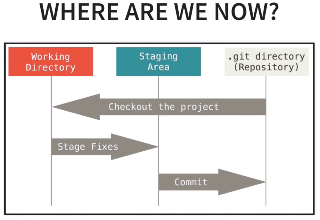

# GIT - Command Line Basics
Basic commands of how to use GIT within the command-line.


## Table of contents:  
* [First Time Setup - Configuration ](#first-time-setup)
	+ [Initialized A Repository From Existing Code](#initialized-a-repository-from-existing-code)
	+ [Cloning A Remote Repo](#cloning-a-remote-repo)
* [Getting Started - Initialize A Repository](#getting-started) 
* [Pushing Changes - Basic Push](#pushing-changes)  
* [Common Workflow - Working With Branches ](#common-workflow) 

<br>

### First Time Setup
Check Version:
```
$ git --version
```

Set Config Values:
```
$ git config --global user.name "myname"
$ git config --global user.email "myname@email.com"

# list all the configuration values
$ git config --list  
```

Need Help?

* git help `<verb>`
* git `<verb>` --help

```
$ git help config
$ git confit --help

# or

$ git add --help
```

### Getting Started
## Initialized A Repository From Existing Code:
```
mkdir <your-reponame>
cd <your-reponame>
$ git init
```

Before First Commit:
```
# get the status of tracked or untracked files
$ git status
```

ADD Gitignore File:
```
# create ignore file to ingnore certain files
$ touch .gitignore
```

Working on the Gitignore File with a Text Editor:
* (optional:)
```
## use vim editor to edit the .gitignore file
vim .gitignore
```
* type the following content:
```
.DS_store.  ## <-- file that you want to ignore
.project    ## <-- file that you want to ignore
## ignore all files with .pyc
*.pyc 
```

Add Files to Staging Area:
```
$ git add . 
# or
$ git add -A

$ git status
```

Remove Files From Staging Area:
```
$ git reset

$ git status
```

First Commit:
```
$ git add .
$ git commit -m "Initial Commit"
$ git status
$ git log
```
Now a local git repository has been setup. But if you want to make it on github, do the following:

* Go to [github](https://github.com/). 
* Log in account. 
* Create the new repository, <your-reponame>, without a README file.
* Push to the Github
```
git remote add origin https://github.com/bing020815/reponame.git
git push origin master
```

## Cloning A Remote Repo:

* git clone <url> <where to clone>

```
$ git clone ../remote_repo.git .

# or

$ git clone https://github.com/username/remote_repo.git .
```

Viewing Information About The Remote Repository:
```
$ git remote -v

# list all of branches on both local machine and remote repository
$ git branch -a
```
<br>

### Pushing Changes
Commit Changes Like We Did Previously:
```
$ git diff
$ git status
$ git add .
$ git commit -m "some changes in the code 1"
```

Then Push:

* always remember to pull any changes that have been made since the last time that we pulled from that remote repository
* `orign`: name of the remote repository
* `master`: branch that we want to push to 

```
$ git pull origin master
$ git push origin master
```

<p align="center"></p>
So, where are we now exactly? Let's review it again.

* Working Directory: 
	+ untracked files and modified files; 
	+ can use `git status` to check
* Staging Area:
	+ a place for organizing files to be committed to the repository
	+ lots of commits for codes and files
* .git Directory:
	+ repository


<br>

### Common Workflow 
Create A Branch For Desired Feature:
```
# create a branch
$ git branch <branch name>
# working on the branch
$ git checkout <branch name>

# list all of branches in the local machine
$ git branch
```

Do Some Changes And Commit The Changes:
```
$ git diff
$ git status
$ git add .
$ git commit -m "some changes in the code 2"
```

After Commit, Push Branch To Remote:

* `-u` option is to tell GIT that we want to associate our local branch with the remote branch. 
* And then, in the future, instead of doing `git push -u origin <branch name>`, we can just do `git pull` and `git push` 
* GIT will know those two branches are associated to each other

```
$ git push -u origin <branch name>

# list all of branches
$ git branch -a
```

Merge A Branch:

* `--merged` option: branches that we have merged in so far

```
$ git checkout master

$ git pull origin master

$ git branch --merged

$ git merg <branch name>

$ git push origin master
```

Deleting A Branch:
```
$ git branch --merged

# delete branch locally
$ git branch -d <branch name>

$ git branch -a

# delete branch in the remote repository 
$ git push origin --delete <branch name>
```

<br>

### Reference:  
* [Git Book Reference](https://git-scm.com/book/en/v2)  
* [Git Tutorial](https://www.youtube.com/watch?v=HVsySz-h9r4&list=PL-osiE80TeTuRUfjRe54Eea17-YfnOOAx&index=1)
